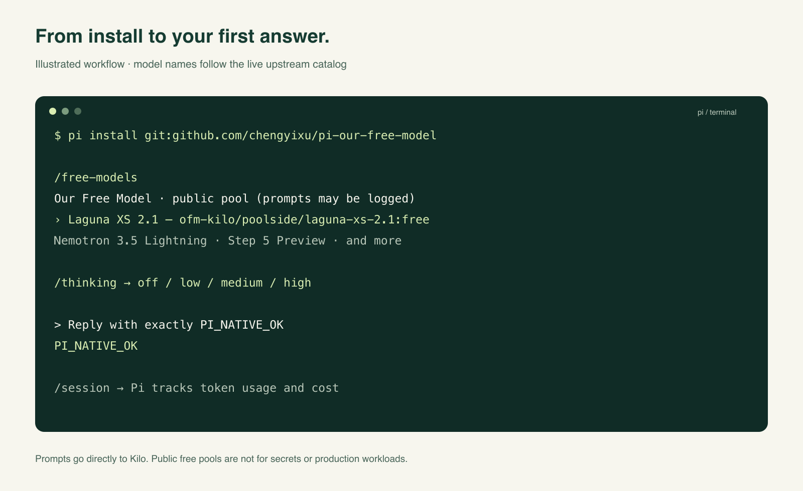

<p align="center"></p>

# Pi Our Free Model

**Public models. Your terminal.** Native free-model discovery and streaming for [Pi](https://pi.dev).

[](https://github.com/chengyixu/pi-our-free-model/actions/workflows/ci.yml)
[](LICENSE)
[](https://pi.dev)
[](https://github.com/chengyixu/pi-our-free-model/releases)

[简体中文](README.zh-CN.md) · [How it works](docs/architecture.md) · [Verification](docs/verification.md) · [Launch kit](docs/launch-kit.md)


Inspired by [Ebony-Vinyl/dsh-our-free-model](https://github.com/Ebony-Vinyl/dsh-our-free-model), rebuilt for Pi rather than wrapped around DSH. The default lane connects **directly to Kilo’s public free pool**: no Kilo account, signup, or API key. Pi keeps control of tools, sessions, reasoning settings, and updates.

> **Free is not unlimited or private.** Upstreams can rate-limit or withdraw models. Kilo says public-pool prompts may be logged or used to improve its services. Do not send secrets, personal data, proprietary code, or production workloads. This project is an independent client, not a model host or an official Pi/Kilo/OpenCode integration.

## Install

Requires **Pi 1.1.0 or newer** and **Node.js 22.19+**. Tested against Pi 1.1.0; future API changes may require an update.

```sh
pi install git:github.com/chengyixu/pi-our-free-model
```

Restart Pi, or run `/reload`. Then:

```text
/free-models
```

Choose a model. You can also use Pi’s `/model` and search for `ofm-kilo`.

For a pinned release:

```sh
pi install git:github.com/chengyixu/pi-our-free-model@v0.1.0
```

No global settings or credentials are edited by the extension itself. `pi install` adds the package using Pi’s normal package manager. Installation/reload can fetch a model catalog but **does not send test inference prompts**.

## What you get

- **Live free-pool discovery.** Only Kilo rows explicitly marked `isFree: true` and declaring tool support are exposed. Paid and moderation-only models are excluded.
- **Native Pi tools and streaming.** Pi’s own API implementations handle text, thinking, tool calls, tool results, usage, and cancellation. No proxy process or extra listening port.
- **Real reasoning controls.** `/thinking` maps to the gateway’s `reasoning` object; unsupported “off” choices are disabled. Very high Pi levels map to upstream `high` where that is the top level.
- **Offline catalog reuse.** Pi’s persistent model store keeps the last successful catalog. `--offline` restores it without discovery I/O. Inference still needs a network connection.
- **Visible failure semantics.** Failed catalog refreshes keep the last list. The plugin does not switch providers, inject fake tools, or replay partial answers. SDK-level inference retries are disabled; Pi’s separately configured agent retries remain Pi’s responsibility.
- **No extra runtime dependencies.** Only Pi-hosted peer libraries. TypeScript is loaded by Pi; there is no plugin build step.

The roster changes upstream. At the [recorded verification](docs/verification.md), 15 models were discovered, including Laguna XS 2.1, Nemotron 3.5 Lightning, and Step 5 Preview. **Listing is not proof that every model is reachable from your region.** Vision capability follows catalog metadata and has not been live-accepted for every model.



*Illustrated workflow, not a captured Pi screenshot. The real CLI smoke test returned `PI_NATIVE_OK`; see [evidence](docs/verification.md).*

## Commands

| Command | Purpose |
| --- | --- |
| `/free-models` | Pick an available model using Pi’s native selector |
| `/free-models list` | Show exact IDs, context limits, and declared vision capability |
| `/free-models use <exact-id>` | Select one model without fuzzy matching |
| `/free-models refresh` | Fetch and persist fresh upstream catalogs |
| `/free-models privacy` | Show destinations, limits, and privacy warnings |
| `/model`, `/thinking`, `/session` | Pi’s native selection, reasoning, and session usage |

One-shot CLI example (the model must still be in the live roster):

```sh
pi --model 'ofm-kilo/poolside/laguna-xs-2.1:free' --thinking off \
  --print 'Explain the difference between a process and a thread'
```

In print mode, command reports appear on **stderr**, keeping normal assistant stdout clean. JSON mode emits custom messages, not raw diagnostic text.

## OpenCode: authorized access only

The original plugin’s anonymous Zen route adds OpenCode client fingerprints and required tool declarations. A direct Pi-identifying request during verification was refused with `FreeTierError: OpenCode’s free tier can only be used from within OpenCode`.

**This port does not impersonate OpenCode or bypass that restriction.** The optional `ofm-zen` provider requires your own authorized `OPENCODE_API_KEY`, or an API key entered through Pi’s `/login`. It discovers free-suffixed chat IDs and reuses Pi’s OpenCode model metadata for their API protocol. Access still depends on OpenCode’s terms and gateway policy. That authenticated path is covered with local contracts, not a live authorized-account acceptance.

```sh
export OPENCODE_API_KEY='your-authorized-key'
pi
# /free-models refresh, then /model and search ofm-zen
```

No pooled credentials, sealed EAC secrets, GitHub-star gates, client spoofing, account farming, or Gemini integration are included. DeepSeek V4.1 Flash and Kimi K3 in the upstream README are **not promised as keyless models by this Pi package**.

## Scope compared with DSH

| Original capability | Pi version |
| --- | --- |
| Keyless public model pool | Kilo, verified live |
| Anonymous OpenCode fingerprint route | Not ported; authorized key only |
| Discovery, thinking, tools, streaming | Native Pi providers |
| Usage board | Pi’s `/session` and session accounting; no extra heatmap |
| In-app self-updater | Pi’s package manager |
| Desktop EAC / thirteen account channels | Not ported |
| Web dashboard, announcements, proxy subscription, LAN forwarder | Not ported; no background server |

This is a focused **0.1.0 Pi-native port**, not feature parity with the upstream’s DSH desktop product.

## Privacy and state

Inference sends conversation history, tool declarations/results, and attached images to the **selected upstream**. Kilo requests go to `https://api.kilo.ai/api/gateway`; authorized Zen requests go to `https://opencode.ai/zen/v1`. There is no maintainer relay, analytics, IP geolocation probe, remote announcement feed, or extension-managed update channel.

The extension reads Pi’s `models-store.json` at startup; Pi is the sole writer of the locked persistent catalog. Credentials and sessions use Pi’s normal storage. Cached catalogs are model metadata, not prompts. Pi sessions may contain conversation content and tool results—this plugin does not make those private or ephemeral.

Update or remove:

```sh
pi update git:github.com/chengyixu/pi-our-free-model
pi remove git:github.com/chengyixu/pi-our-free-model
```

Pinned installs do not move to newer tags automatically; install the next tag explicitly. Removal unloads the provider but does not delete Pi’s stored sessions or catalog history.

## Development

```sh
git clone https://github.com/chengyixu/pi-our-free-model
cd pi-our-free-model
npm ci --ignore-scripts
npm run check
pi -e .
```

`npm test` is hermetic: local HTTP fixtures plus the **real Pi CLI**. It covers paid-model exclusion, cache/offline startup, transaction rejection, streaming with incorrect headers, Unicode splits, tools/results, usage, instrumentation, cancellation, truncation, and quota failures. CI runs on Linux/macOS and Node 22.19/24. Optional `npm run test:live` sends one harmless prompt to Kilo and consumes free allowance; it is never part of CI.

Visual assets are authored SVGs with verified PNG exports. Regenerate with `node scripts/render-assets.mjs` (requires `rsvg-convert`). [Launch kit](docs/launch-kit.md) includes social copy, the GitHub preview, and attribution.

## Credit and license

MIT. Thanks to [Ebony-Vinyl](https://github.com/Ebony-Vinyl) for the original project and its detailed public gateway research. See [NOTICE](NOTICE) for the scope of inspiration and attribution. Vendor names belong to their respective owners; no affiliation or endorsement is implied.
