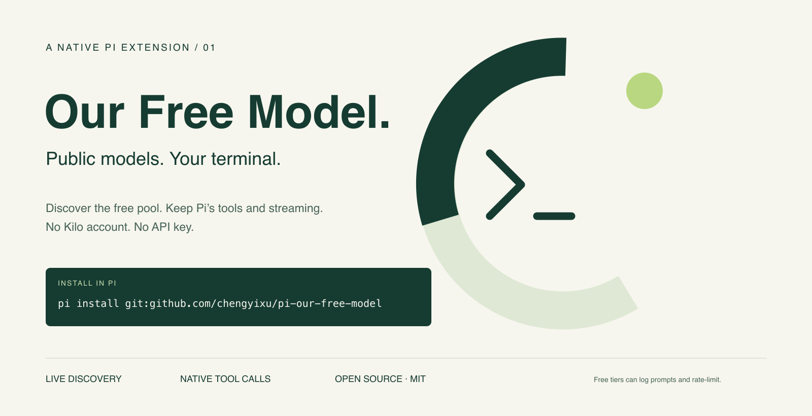

# Pi Our Free Model

**公开免费模型，直接用在你的终端。** 为 [Pi](https://pi.dev) 原生重写的模型扩展。

[English](README.md) · [架构](docs/architecture.md) · [验证记录](docs/verification.md)



灵感来自 [Ebony-Vinyl/dsh-our-free-model](https://github.com/Ebony-Vinyl/dsh-our-free-model)。这不是 DSH 包装器：扩展直接注册 Pi Provider，默认连接 **Kilo 的公开免费模型池**，无需 Kilo 账号、注册或 API Key。工具调用、流式输出、会话和更新由 Pi 自己负责。

> **免费不等于无限，也不等于隐私。** 上游可以限流、调整或停止供应。Kilo 提示：免费池的提示词可能被记录或用于改进服务。请勿发送密钥、个人信息、商业机密、私有代码或生产任务。项目不隶属于 Pi、Kilo 或 OpenCode。

## 安装

需要 Pi 1.1.0+、Node.js 22.19+；当前验证版本为 Pi 1.1.0。

```sh
pi install git:github.com/chengyixu/pi-our-free-model
```

重启 Pi，或执行 `/reload`，然后输入 `/free-models` 选择模型。也可以在 `/model` 搜索 `ofm-kilo`。

固定版本：

```sh
pi install git:github.com/chengyixu/pi-our-free-model@v0.1.0
```

安装和刷新只请求模型清单，不自动发送推理探测。扩展本身不修改全局设置或凭据。

## 能力

- 动态发现明确标为 `isFree: true` 且声明工具支持的 Kilo 模型，排除收费和纯审核模型。
- 复用 Pi 的文本、思考、工具调用/结果、用量统计和取消机制，不启动网关进程或监听端口。
- `/thinking` 对应真实的上游 reasoning 参数；不支持关闭思考的模型不会提供该选项。
- Pi 保存最近成功清单。`--offline` 不发送发现请求；实际推理仍需联网。
- 清单刷新失败保留旧清单，不偷偷切换模型、供应商或重发半截回答。扩展关闭 SDK 自动重试，Pi 自己的 Agent 重试策略仍由用户配置。
- 仅使用 Pi 提供的 peer dependencies，无插件编译步骤。

当次验证发现 15 个模型，其中包括 Laguna XS 2.1、Nemotron 3.5 Lightning 和 Step 5 Preview。模型清单随上游变化；列出不代表每个地区都能调用，视觉能力也未逐个进行真实上游验收。

## 命令

| 命令 | 用途 |
| --- | --- |
| `/free-models` | 原生模型选择器 |
| `/free-models list` | 精确模型 ID、上下文和清单声明的视觉能力 |
| `/free-models use <exact-id>` | 按精确 ID 选择 |
| `/free-models refresh` | 更新清单 |
| `/free-models privacy` | 隐私与限制说明 |
| `/model`、`/thinking`、`/session` | Pi 自带的模型、思考和会话用量功能 |

print 模式的命令报告写入 stderr；JSON 模式通过 custom message 发送，不污染协议输出。

## 与原项目的区别

原项目的匿名 OpenCode 路线声明 OpenCode 客户端指纹及指定工具。真实验证中，明确标识为 Pi 的匿名请求被拒绝：`FreeTierError: OpenCode's free tier can only be used from within OpenCode`。

**本扩展不伪装 OpenCode，不用虚假工具绕过该限制。** 可选 `ofm-zen` 路线需要你自己的合法 `OPENCODE_API_KEY`，或通过 `/login` 输入授权 Key；仍受 OpenCode 服务政策限制。此路线有本机协议测试，但未进行真实授权账号验收。

0.1.0 不包含桌面 EAC、GitHub 点星门槛、十三个账号渠道、Gemini 集成、网页看板、公告、代理订阅和局域网转发。用量查看和更新采用 Pi 原生功能。**不承诺原 README 中的 DeepSeek V4.1 Flash、Kimi K3 在 Pi 中免密可用。**

## 数据与开发

提示词、会话历史、工具结果和图片直接发送到所选供应商。Kilo 地址为 `https://api.kilo.ai/api/gateway`；授权 Zen 地址为 `https://opencode.ai/zen/v1`。没有维护者中转、遥测、出口 IP 查询或自更新后台。

清单由 Pi 的 `models-store.json` 保存，只有 Pi 写入；凭据及会话遵循 Pi 自身存储规则。移除扩展不会删除旧会话或模型缓存。

```sh
pi update git:github.com/chengyixu/pi-our-free-model
pi remove git:github.com/chengyixu/pi-our-free-model
```

固定 tag 不会自动跳到新版本。

```sh
npm ci --ignore-scripts
npm run check
pi -e .
```

自动测试只使用本机 HTTP 替身和真实 Pi CLI。`npm run test:live` 单独向 Kilo 发送一条无敏感内容的测试提示，消耗免费额度，不进入 CI。

MIT。感谢 Ebony-Vinyl 的原项目及公开协议研究；详见 [NOTICE](NOTICE)。
